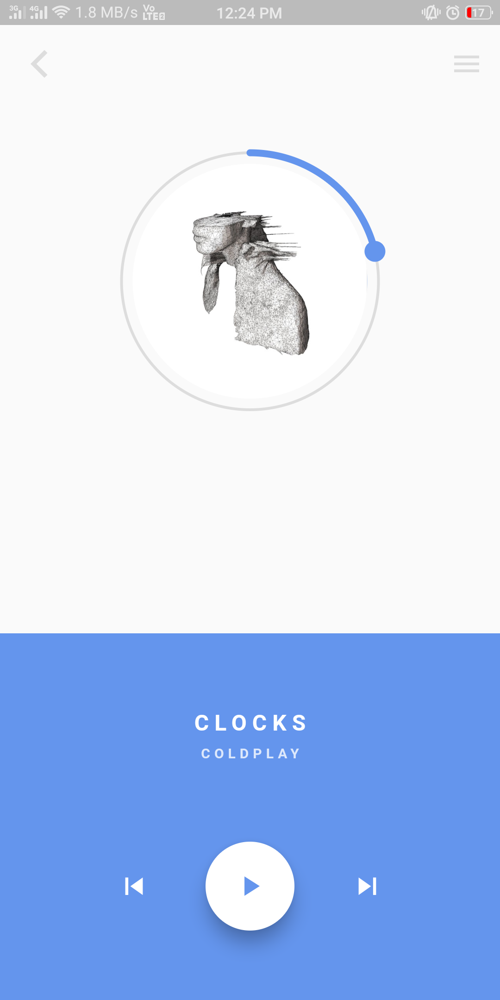
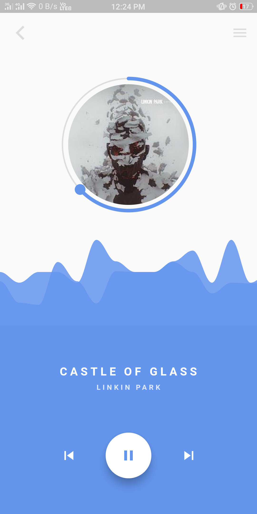

# Music Player

A minimal music player using Flutter.

## Idea

Based on the [tutorial](https://www.youtube.com/watch?v=FE7Vtzq52xg) from [Matthew Carroll](https://github.com/matthew-carroll).

## Screenshots

 
